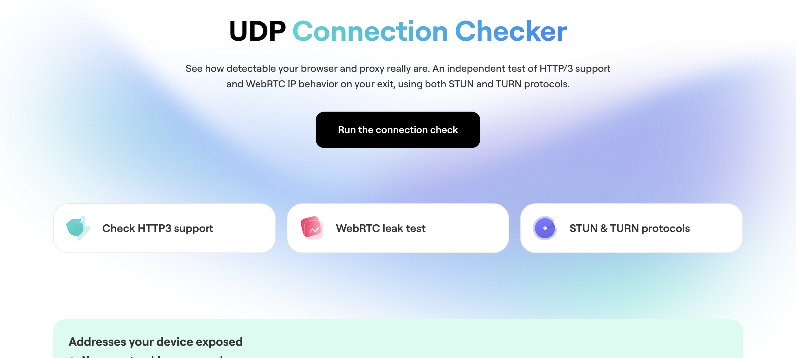

<div align="center">

# Connection Checker

### Is your proxy actually hiding you?

A tool that shows whether your connection is quietly leaking your real identity — even when you are behind a proxy or VPN. It runs a series of checks in the browser and compares **what your browser reports** with **what the server actually observes**, so a masked or spoofed address gets caught instead of trusted.

[**▶ Try the live demo**](https://nodemaven.com/tools/connection-checker/) &nbsp;·&nbsp; [What it checks](#what-it-checks) &nbsp;·&nbsp; [Self-host](#self-host-in-5-minutes) &nbsp;·&nbsp; [How it works](#how-it-works)

   



</div>

---

## Why this exists

A proxy is supposed to hide your real IP. But hiding your main connection is not enough — your browser has **other channels** that can give you away on their own:

- **WebRTC** can reveal a real IP over a path the proxy never touches.
- **HTTP/3 (QUIC)** rides on UDP, which many proxies cannot carry, so traffic can slip out directly.
- Your browser can **report one address while the server sees another**.

If any of that happens, you look protected but you are exposed — usually without knowing it. Connection Checker measures exactly these gaps and tells you, in plain colors, whether your setup holds up.

## What it checks

| Check | Question it answers |
|---|---|
| **Exit IP** | What IP does the world actually see for you right now? |
| **WebRTC (STUN / TURN)** | Does WebRTC leak an address your proxy is trying to hide? |
| **HTTP/3 (QUIC)** | Can your connection carry UDP, or does it fall back to TCP? |
| **Consistency** | Do all channels agree, or does one expose a different identity? |

Every result is color-coded:

- 🟢 **Green** — clean. Everything matches, nothing is leaking.
- 🟠 **Amber** — inconclusive or a channel is blocked. We don't guess.
- 🔴 **Red** — a real address was exposed on at least one channel.

## How it works

The key idea is that the tool **does not just trust the browser**. For every channel it also has a server-side view, and then it compares the two:

```
   Your browser  ──▶  claims an identity (exit IP, WebRTC candidates, HTTP/3 support)
                              │
                              ▼   compare
   Our servers   ──▶  observe the real source of your traffic on each channel
```

If the browser claims one thing and the servers observe a different real address, that is a leak — and no amount of masking in the browser can hide it from a server that watched the packet arrive.

## Architecture

```
connection-checker/
├── frontend/                 # Static HTML/JS — the checks that run in the browser
└── backend/
    ├── credentials/          # Python service: mints short-lived TURN credentials
    ├── coturn/               # TURN/STUN relay + server-side observation
    │   ├── stun-observe/      #   records the real UDP source per session
    │   └── turn-readback/     #   read-only view of what the relay observed
    └── http3-probe/          # HTTP/3 (QUIC) + exit-IP probe endpoint
```

All backend services are self-contained and run with Docker. No part of the tool needs any specific hosting provider — you point the frontend at your own backend and you are done.

## Self-host in 5 minutes

> Requires Docker and a server with a public IP (the TURN/HTTP-3 checks need reachable UDP ports).

```bash
git clone https://github.com/nodemaven/connection-checker.git
cd connection-checker

# 1. configure
cp .env.example .env          # fill in your domain + generated secrets

# 2. run the backend
docker compose up -d

# 3. open the frontend
#    serve the frontend/ folder from any static host and point it
#    at your backend URL (see frontend/README.md)
```

Full setup — DNS, TLS, firewall ports and generating the secrets — is in [`docs/SELF_HOSTING.md`](docs/SELF_HOSTING.md).

## Contributing

Issues and pull requests are welcome. See [`CONTRIBUTING.md`](CONTRIBUTING.md). Found a security issue? Please read [`SECURITY.md`](SECURITY.md) before opening a public issue.

## License

[MIT](LICENSE) — free to use, self-host, and adapt.

---

<div align="center">

Built by **[NodeMaven](https://nodemaven.com)** — residential & mobile proxies with clean, pre-filtered IPs.
<br>
Our proxies pass every one of these checks. [See for yourself.](https://nodemaven.com/tools/connection-checker/)

</div>
