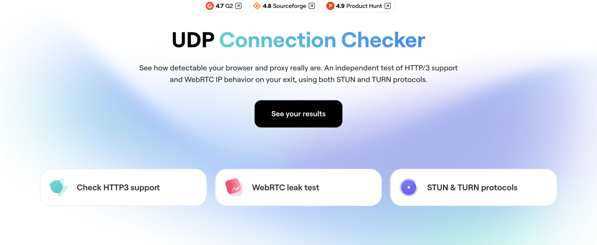

<div align="center">

<!-- Org mark, byte-identical to the one on the org profile and proxy-benchmark
     (md5 2fbcc1624ea51bacf95ca6e9c5c7c686) so the pages read as one set.
     Relative path so it survives a fork. -->
<a href="https://github.com/nodemaven"></a>

<!-- Animated flow (SMIL, plays in the GitHub README): a request travels
     Browser -> Proxy -> Target. -->


# Connection Checker

### Is your proxy actually hiding you?

A tool that shows whether your connection is quietly leaking your real identity, even when you are behind a proxy or VPN. It runs a series of checks in the browser and compares **what your browser reports** with **what the server actually observes**, so a masked or spoofed address gets caught instead of trusted.

[**▶ Try the live demo**](https://nodemaven.com/tools/connection-checker/) &nbsp;·&nbsp; [What it checks](#what-it-checks) &nbsp;·&nbsp; [What it does not](#what-it-does-not-check) &nbsp;·&nbsp; [How it works](#how-it-works) &nbsp;·&nbsp; [What is stored](#what-is-stored) &nbsp;·&nbsp; [Self-host](#self-host-in-5-minutes)

[](https://github.com/nodemaven/connection-checker/actions/workflows/tests.yml)    



</div>

---

## Why this exists

A proxy is supposed to hide your real IP. But hiding your main connection is not enough. Your browser has **other channels** that can give you away on their own:

- **WebRTC** can reveal a real IP over a path the proxy never touches.
- **HTTP/3 (QUIC)** rides on UDP, which many proxies cannot carry, so traffic can slip out directly.
- Your browser can **report one address while the server sees another**.

If any of that happens, you look protected but you are exposed, usually without knowing it. Connection Checker measures exactly these gaps and tells you, in plain colors, whether your setup holds up.

## What it checks

| Check | Question it answers |
|---|---|
| **Exit IP** | What IP does the world actually see for you right now? |
| **WebRTC (STUN / TURN)** | Does WebRTC leak an address your proxy is trying to hide? |
| **HTTP/3 (QUIC)** | Can your connection carry UDP, or does it fall back to TCP? |
| **Consistency** | Do all channels agree, or does one expose a different identity? |

Every result is color-coded:

- 🟢 **Green**: clean. Everything matches, nothing is leaking.
- 🟠 **Amber**: inconclusive or a channel is blocked. We don't guess.
- 🔴 **Red**: a real address was exposed on at least one channel.

## What it does not check

A green result means the channels this tool measures agreed. It is not a
clean bill of health for your whole setup. Known gaps, stated plainly:

- **DNS is not tested.** Your DNS resolver can expose you independently of every
  channel here, and nothing in this tool looks at it. Use a dedicated DNS leak
  test alongside it.
- **Amber is not green.** If a channel is blocked or inconclusive we say so
  rather than guessing. A blocked channel is unmeasured, not proven safe.
- **The result is a snapshot.** It describes the connection at the moment you
  ran it. Rotating proxies, a reconnect or a network change can invalidate it
  seconds later.
- **Browser and extension dependent.** WebRTC behaviour varies between browsers
  and can be changed by extensions and flags. A pass in one browser does not
  transfer to another on the same connection.
- **We measure the channels, not your fingerprint.** Canvas, fonts, timezone and
  the rest of browser fingerprinting are out of scope here.

IPv6 is handled: addresses are normalised, IPv4-mapped forms are unwrapped, and
comparison is done on the /64 prefix so RFC 4941 privacy addresses do not read
as a false mismatch.

## How it works

The key idea is that the tool **does not just trust the browser**. For every channel it also has a server-side view, and then it compares the two:

```
   Your browser  ──▶  claims an identity (exit IP, WebRTC candidates, HTTP/3 support)
                              │
                              ▼   compare
   Our servers   ──▶  observe the real source of your traffic on each channel
```

If the browser claims one thing and the servers observe a different real address, that is a leak, and no amount of masking in the browser can hide it from a server that watched the packet arrive.

## What is stored

The tool observes the real source of your traffic, so it is fair to ask what
happens to that. From the code in this repository:

| Service | What it holds | For how long |
|---|---|---|
| `stun-observe` | the observed UDP source address, keyed by a random per-session token (`stunobs:<token>`) | 120 s, set via Redis `SETEX` (`STUN_OBS_TTL`) |
| `credentials` | nothing. TURN credentials are minted, returned and never stored | credential itself is valid 120 s (`CRED_TTL`) |
| `http3-probe` | nothing. It answers from the request and keeps no state | not applicable |

There is no database, no account and no analytics in this repository. Nothing is
keyed to a user, only to a random token that expires with the observation. If you
self-host, both TTLs are yours to change in `.env`.

## Architecture

```
connection-checker/
├── frontend/                # Static HTML/JS: the checks that run in the browser
└── backend/
    ├── credentials/         # Python service, mints short-lived TURN credentials
    ├── coturn/              # TURN/STUN relay + server-side observation
    │   ├── stun-observe/    #   records the real UDP source per session
    │   └── turn-readback/   #   read-only view of what the relay observed
    └── http3-probe/         # HTTP/3 (QUIC) + exit-IP probe endpoint
```

All backend services are self-contained and run with Docker. No part of the tool needs any specific hosting provider. You point the frontend at your own backend and you are done.

## Self-host in 5 minutes

> **Requires** Docker with Compose **v2.20.3 or newer** (the root `docker-compose.yml`
> uses the `include:` key, which Docker documents as fully supported from 2.20.3), and a server with a public IP. The TURN and HTTP/3
> checks need reachable UDP ports, so this will not work behind NAT.

```bash
git clone https://github.com/nodemaven/connection-checker.git
cd connection-checker

# 1. configure the services
cp .env.example .env          # fill in your domain + generated secrets

# 2. configure coturn separately
#    turnserver.conf is git-ignored because it holds the shared secret,
#    so it has to be created by hand. static-auth-secret must match
#    TURN_STATIC_AUTH_SECRET in .env, or every TURN check fails.
cp backend/coturn/turnserver.conf.example backend/coturn/turnserver.conf

# 3. run the backend
docker compose up -d --build
docker compose ps             # everything healthy?

# 4. open the frontend
#    serve the frontend/ folder from any static host and point it
#    at your backend URL (see frontend/README.md)
```

You also need UDP 3478 and the relay range UDP 49160-51159 open on your firewall.
Full setup, DNS, TLS, firewall rules and generating the secrets, is in
[`docs/SELF_HOSTING.md`](docs/SELF_HOSTING.md).

## Contributing

Issues and pull requests are welcome. See [`CONTRIBUTING.md`](CONTRIBUTING.md). Found a security issue? Please read [`SECURITY.md`](SECURITY.md) before opening a public issue.

## License

[MIT](LICENSE), free to use, self-host, and adapt.

---

<div align="center">

Built by **[NodeMaven](https://nodemaven.com)**, residential and mobile proxies with clean, pre-filtered IPs.
<br>
We built this to test our own exits, and we did not special-case them. Run it
against whatever you use, ours included: [live demo](https://nodemaven.com/tools/connection-checker/).
<br>
For how we measure proxies more generally, and where our own earlier conclusions
turned out to be wrong, see [proxy-benchmark](https://github.com/nodemaven/proxy-benchmark).

</div>
